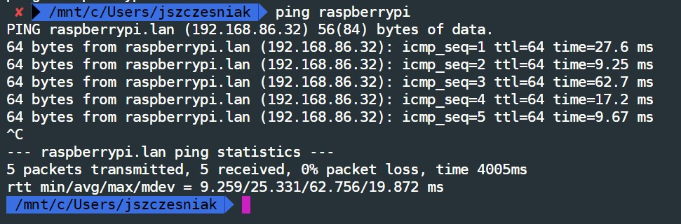

This file will document the steps required in order to get the Raspberry Pi set up as both the MQTT broker and data collection device.

## Operating System

The first step is to download and install Raspberry Pi OS.
The OS image can be found at [this](https://www.raspberrypi.org/downloads/raspberry-pi-os/) location; just make sure that you are downloading the Lite version.
There isn't any need to download the full desktop environment at this point.

Next you will to burn the image to an SD card.
I am testing this installation with a 16GB microSD card and burning it with the on-board SD reader/writer on my Dell laptop.

You'll want to get a copy of [balenaEtcher](https://www.balena.io/etcher/) and then follow the on-screen direction to locate the downloaded .img file as well as point it to the SD card location on your machine.


## Pre boot configurations

Since we are installing the OS without a desktop environment, we need to set up a few items *prior* to the first run.

### SSH

In order to be able to access the headless device, we'll want to get `ssh` setup at boot.
After you have burned the image to the SD card, remove, then re-insert the SD card into your machine.
Then, open up the SD card drive in and go to the /boot folder.
Create a new file called `ssh` in this boot drive.
When the Pi boots, it looks for the `ssh` file.
If it is found, SSH is enabled and the file is deleted.

### WiFi

While I don't think that we necessarily need to have Internet enabled WiFi for the project, it will be useful to have for initial setup.
The following directions are to be run prior to first boot of the device in order to get WiFi running for a headless setup.

We will need to create a file called `wpa_supplicant.conf` under the same /boot directory used above for the `ssh` file.
There is a sample file located in this repository that should be used as a template; just replace the SSID and password for your specific home network.

## First Boot

Eject the SD card from your computer and insert it into the RPi.
For testing purposes, power the RPi with a USB cord connected to a wall wart.
Then reboot the RPi with the new OS.

Give the device a few moments to boot up, then move over to the bash terminal and make sure that the Pi is seeing the network.
This can be as simple as:

```bash
ping raspberrypi
```

If all goes well, you should see a transmission and return of packets in your terminal with minimal latency.



## Set up the Base System

### SSH

First up, we need to make sure that I can `ssh` into the sytem.
Previousl, we created a file that made sure that `ssh` was available on a headless restart, but now we need to make it all available.

```bash
ssh-keygen -R raspberrypi  # Adds the RPi to the list of known hosts on my bash terminal
ssh pi@raspberrypi         # log in to the RPi via ssh
# password is `raspberry` when prompted
```

There will be a warning that you am running `ssh` with the default user password. You can ignore that for now because we are going to update that from within the `raspi-config` command next.

### raspi-config

From your development terminal:

```bash
ssh pi@raspberrypi
sudo raspi-config
```

Once in the `raspi-config` menus, well have a bunch of options.
We are already on a network so we can skip that.
But, we do need to change the password for the pi user.
Next we have the ability to change our user password, which we will change to the standard BCJ-tech password.

### Hostname

The hostname is the 'name' of the RPi.
We need to change this to be less generic and more aligned with the BCJ technology standards.

Within the `raspi-config` menu, Option 2; select Change network options.
Then select option `N1` for hostname.
For development purposes, I have named the device `BCJ-R01`, short for BCJ remote device 01.

Time for a quick reboot with `sudo shutdown -r now`.
After the reboot, my ssh command will be `ssh pi@BCJ-R01`.

### Maintenance

Next up, a little maintenance to make sure that what I have is the latest and greatest.
`sudo apt update -y && sudo apt upgrade -y`

Now we have a fully functioning, headless, RaspberryPi updated and waiting to be set up for our data collection needs.
